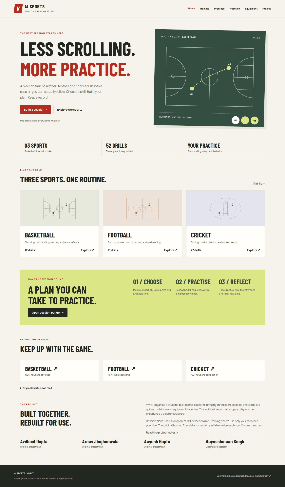

# AI Sports / Vivriti

A student sports project rebuilt into a practical training workspace. It covers basketball, football and cricket, preserving the original drill content and hosted assistant integrations while adding tools that work without an AI service.

**[Open the workspace](https://modeldog8197.github.io/VIVRITI-FINAL/?v=2)**



## What you can do

| Tool | Behaviour |
| --- | --- |
| Drill library | All 52 original drills: 12 basketball, 13 football, 27 cricket. Search and filter by sport, skill and experience; save favourites. |
| Session builder | Choose 15–90 minutes, a skill, solo/team practice and experience. Produces an exact-duration sequence including a five-minute warm-up and three-minute cool-down. |
| Practice timer | Start, pause, reset and step between blocks. Measures elapsed time with a deadline, so background tab throttling does not accumulate timer drift. |
| Training journal | Record actual minutes, effort and a reflection. Interactive seven-day chart; CSV export; validated, mergeable JSON backups; deletion with undo. |
| Nutrition organiser | Vegetarian, vegan and omnivore food ideas; ingredient exclusions; downloadable grocery checklist; optional adult BMI reference separated from meal planning. |
| Equipment | Sport-specific kit checklists, local saved selections and all 24 original product links grouped by category. No simulated cart or checkout. |
| Coach tools | Offline keyword-based drill finder and the three original GPT-Trainer assistants, loaded only on request. |
| News | Links to sport organisations and the original RSS.app feed, loaded on request. |

All existing public routes remain usable: `bb.html`, `fb.html`, `cricket.html`, `mypage.html` and `shop.html`. The old backup route leads to the updated home page.

## How the session builder works

The builder is deterministic, not generative AI. It filters drills by sport, selected skill and group size. Foundation mode excludes advanced drills. For a mixed session it takes one drill per available skill before filling remaining places, up to three drills. It splits the remaining minutes evenly, distributing the integer remainder across the first blocks. A selected skill with no compatible solo drill returns an explicit error instead of silently introducing team exercises.

The original drill descriptions have been converted to structured records. Advanced explosive, contact and diving exercises are marked for qualified supervision. Drill durations are planning allocations, not validated prescriptions; adapt the session with a coach. The diagrams are illustrations rather than official field dimensions or motion measurements.

## Data and measurements

The journal begins empty. There are no fabricated training results, streaks or athletic scores. Daily bars total actual user-entered minutes. Session load is **minutes × self-reported effort**, displayed as effort-minute units; it does not predict fitness or injury. Planned and actual minutes remain separate.

Entries, favourites and selected kit groups are stored in browser `localStorage`. They do not sync across devices. If browser storage is unavailable, entries can remain in memory for that visit and the interface asks the user to export them. Private browsing or clearing site data can remove records. Export a JSON backup for durability.

Backups have a versioned schema, a 1.5 MB file limit and a maximum of 1,000 entries. Imports validate every entry before changing the journal. Existing IDs take precedence, duplicate IDs within an import are rejected, and repeated imports do not multiply entries. Notes are rendered as text and spreadsheet-formula prefixes are escaped in CSV downloads.

No names, height, weight or nutrition choices are stored. Height and weight are used transiently for the optional BMI calculation.

## Nutrition scope

This edition replaces the original BMI-triggered restrictive calorie plans. Food cards are examples with no calorie targets, portion requirements or medical claims. Ingredient exclusions cover only listed example ingredients, not packaging or cross-contact. Consult a qualified dietitian for individual needs.

The general variety guidance is based on [WHO: Healthy diet](https://www.who.int/news-room/fact-sheets/detail/healthy-diet), checked 7 October 2026. BMI is an educational screening reference only: [CDC adult BMI](https://www.cdc.gov/bmi/adult-calculator/index.html) applies from age 20; younger users are directed to [CDC child and teen BMI](https://www.cdc.gov/bmi/child-teen-calculator/index.html). The app does not classify children using adult thresholds or generate meals from BMI.

## Hosted services

The original GPT-Trainer widget IDs are retained for all three sports. The default interface makes no requests to those services; loading an assistant sends requests and any submitted messages to that provider. The assistants may need an active provider subscription. Their availability, response quality and underlying prompts are outside this repository. The local drill finder stays usable if they are unavailable.

The original RSS.app news feed is also optional. External retailer links are browsing references. Prices, stock, fit and suitability must be checked with the retailer.

## Development and tests

```sh
npm ci
npm test
npx playwright install chromium
npm run test:e2e
python3 -m http.server 4173
```

Open `http://localhost:4173`. The app uses ES modules and should be served over HTTP, not opened as a `file://` document. No backend, build tool, API key or runtime dependency is required. Barlow Condensed and Manrope are self-hosted with their SIL Open Font License files. Core tools make no external requests.

Node tests cover drill preservation, filtering, exact session budgets, group/experience constraints, input and backup validation, daily aggregation, age-aware BMI handling, ingredient exclusions and output escaping. Playwright exercises every page at desktop and phone sizes, favourites, the timer and logging flow, safe backup imports, meal controls, equipment persistence and opt-in assistant URLs. Hosted-provider responses are stubbed in automated tests; passing tests do not assert that those providers are available.

GitHub Actions runs both suites on pushes and pull requests. GitHub Pages serves the static project from the root of `main`.

## Project structure

- `app.js`: shared page templates, interactions, timer and local persistence.
- `engine.js`: pure selection, validation, aggregation and export functions.
- `drills.json`: original drill library in structured form.
- `foods.js`: educational meal examples and ingredient tags.
- `products.js`: original retailer catalogue links.
- `style.css`: responsive sports-oriented design and print styles.
- `tests/`: unit and browser regression checks.

Original media and legacy styles/scripts remain in the repository for historical continuity. The active workspace does not load background videos or depend on legacy scripts.

## Attribution

Original project team: **Arnav Jhujhunwala, Aayush Gupta, Aayusshmaan Singh and Avdhoot Gupta**. The original concept, sport content and chatbot integrations are a team project. This rebuild preserves that attribution and does not invent user counts, awards, training outcomes or individual ownership claims.
